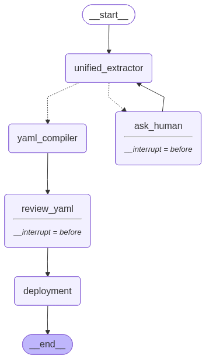

# LogFormat

This app is tasked with updating the log-format.xml file.
It has certain important files which are :

- `agent.py` : It contains the main agent which is tasked with automating the entire process.

- `app.py` : The UI interface which gives a user-friendly way to interact with the agent.

- `deploy.py` : The role of deploy.py is to merge the XML ffragment generated from the user input to the main log-format.xml file .

- `graph.py` : This file contains the pydantic datastructure that the agent fills up. This is done to prevent hallucination of the agent as it has to follow the stucture strictly.

- `xmlGenerator.py` : This file generates the XML fragment from the YAML.

- `schema_map.json` : This file contains the blueprint using which the xmlGenerator can generate the XML. This file tries to decouple the formatting logic as much as possible from the XML generator program. Changes can be made to it ; like updation of attributes or addition of them without affecting a single line of code in xmlGenerator.

## Agent Architecture



### For Further Documentation please go through these steps : 

This project uses Sphinx to generate HTML documentation directly from the Python source code. 

**To view the documentation locally:**

1. **Install the documentation dependencies:**
   Ensure you have Sphinx and the Read the Docs theme installed in your virtual environment:
   ```bash
   pip install sphinx sphinx_rtd_theme
   ```
2. **Build the HTML Site:** 
   Navigate into the docs folder and trigger the build process.
   ```bash
   cd LogFormat/docs
   make html
   ```
3. **Open the Website:**
   This site will be generated inside your local docs/build/html/ directory. Open the index.html file in your browser.
   ```bash
   open LogFormat/docs/build/html/index.html
   ```
 
