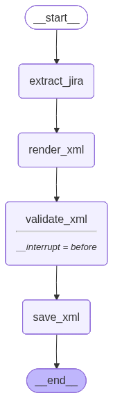

# Query Table

This app is tasked with updating or creating new Query Tables. It has certain important files which are
:

- `main.py` : It contains the main agent which automates the entire process.
- `app.py` : It is the gradio app to access the agent.
- `pyd.py` : This file contains the pydantic data structure that the agent fills up.
             This is done to prevent the agent from hallucinating and force it to give the output in a desired structured format.
- `table_template.xml`: The Jinja2 template used to generate XML files from scratch for brand new tables.

- `table_template.xml` : This file contains a Jinja template. After the agent fills up the pydantic data structure; the data is used to create the actual xml file from this template.
- `xmlMerger.py`: The specialized ElementTree parsing engine that surgically inserts or patches columns, descriptions, and historical queries into existing XML trees without escaping HTML tags.

## Agent Architecture



### For Further Documentation please go through these steps : 

This project uses Sphinx to generate HTML documentation directly from the Python source code. 

**To view the documentation locally:**

1. **Install the documentation dependencies:**
   Ensure you have Sphinx and the Read the Docs theme installed in your virtual environment:
   ```bash
   pip install sphinx sphinx_rtd_theme
   ```
2. **Build the HTML Site:** 
   Navigate into the docs folder and trigger the build process.
   ```bash
   cd QueryTable/docs
   make html
   ```
3. **Open the Website:**
   This site will be generated inside your local docs/build/html/ directory. Open the index.html file in your browser.
   ```bash
   open QueryTable/docs/build/html/index.html
   ```
   
